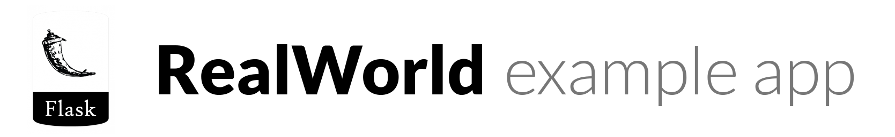

#  
> ### Flask codebase containing real world examples (CRUD, auth, advanced patterns, etc) that adheres to the [RealWorld](https://github.com/gothinkster/realworld-example-apps) spec and API.


# Getting started

## Installation

First, clone this repository and switch to the repository.
```
git clone git@github.com:a-r-g-v/realworld-flask.git
cd realworld-flask
```

If you don't want to dirty system, you can use virtualenv.
```
sudo pip install virtualenv
virtualenv venv
. venv/bin/activate
```

Install the dependencies using pip
```
pip install -r requirements.txt
```

Initialize the database
```
./manage.py db init
./manage.py db migrate
./manage.py db upgrade
```

Start the server for development
```
./manage.py run
```

You can access the server at http://localhost:5000


## Configuration
WIP

## Testing

First, install nose that is test runner.
```
sudo pip install nose
```

Install the dependencies for testing
```
pip install -r requirements-test.txt
```

Run the test cases
```
python -m nose 
```


# Overview

## Dependencies

- flask-classful ... For utilization of useful MethodView
- webargs ...  For validation and deserialization of request object
- flask-marshmallow ... For clarification and serialization of response object
- flask-sqlalchemy ... For integration of SQLAlchemy
- flask-migrate ... For migration support of flask-sqlalchemy
- flask-jwt-extended ... For authentication using JWT
- flask-cors ... For support of Cross Origin Resource Sharing
- flask-bcrypt ... For generating a hash of password.

# Files
WIP

